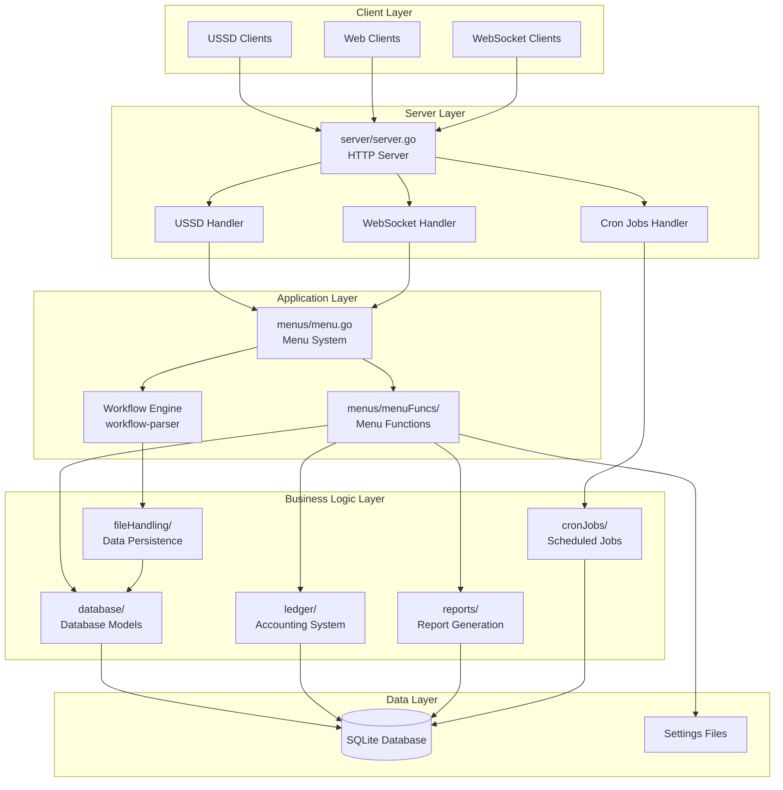
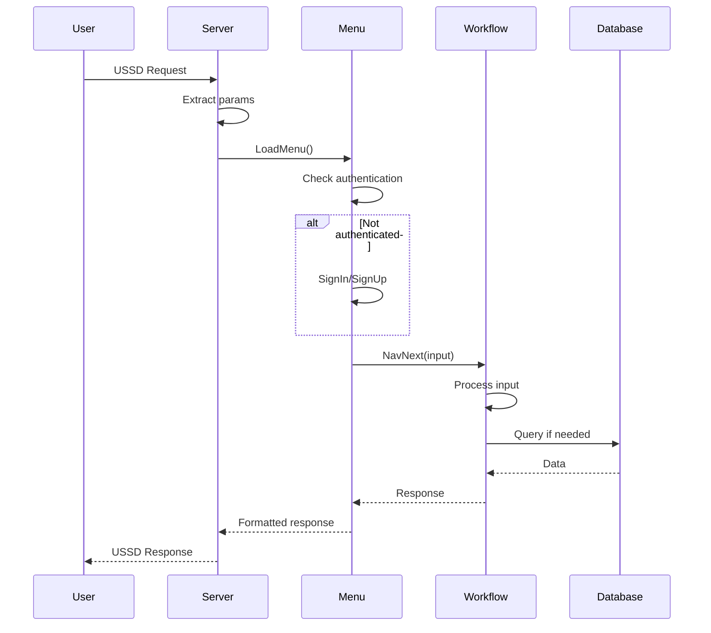
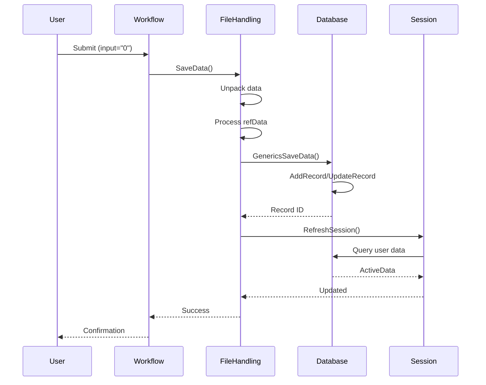
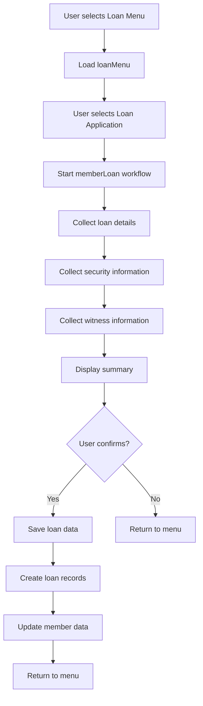

# Architecture Documentation

## Overview

The `sacco-schema` is a comprehensive SACCO (Savings and Credit Cooperative Organization) management system built in Go. It provides a complete solution for managing members, loans, contributions, savings, and financial transactions through multiple interfaces including USSD (Unstructured Supplementary Service Data) and WebSocket-based web applications.

The system leverages the `workflow-parser` library for dynamic form-driven workflows, enabling rapid development of complex data collection and processing flows without hardcoding business logic.

## System Architecture



## Package Structure

```
sacco-schema/
├── cmd/
│   ├── gen/              # Code generation tool (Draw.io to SQL)
│   ├── server/           # Server entry point
│   └── wscli/            # WebSocket client tool
├── server/                # HTTP server and handlers
│   ├── server.go          # Main server logic
│   └── index.html         # Web interface
├── menus/                 # Menu system and orchestration
│   ├── menu.go            # Menu loading and navigation
│   ├── cacheResolver.go   # Cache data resolution
│   └── menuFuncs/         # Menu function implementations
│       ├── signIn_fn.go
│       ├── signUp_fn.go
│       ├── checkBalance_fn.go
│       └── ...
├── database/              # Database models and operations
│   ├── database.go        # Database initialization
│   ├── model.go           # Generic model CRUD
│   ├── models.go          # Model definitions
│   ├── model2workflow.go  # Model to workflow conversion
│   └── fullMemberRecord.go # Member record loading
├── ledger/                # Double-entry accounting
│   ├── ledger.go          # Transaction processing
│   └── models/            # Account models
├── reports/               # Report generation
│   ├── loansReport.go     # Loan reports
│   ├── contributionsReport.go # Contribution reports
│   └── reports.go        # Base report struct
├── cronJobs/              # Scheduled jobs
│   └── cronJobs.go        # Interest calculations
├── fileHandling/          # Data persistence
│   └── fileHandlers.go    # Save operations
└── database/schema/       # Database schema
    ├── schema.sql         # Table definitions
    ├── seed.sql           # Initial data
    ├── rates.sql          # Rate configurations
    ├── models/            # YAML model definitions
    ├── triggers/          # Database triggers
    └── configs/           # Configuration files
```

## Component Descriptions

### 1. Server Package (`server/`)

**Purpose**: HTTP server that handles USSD requests, WebSocket connections, and cron job triggers.

**Key Components**:

- **`ussdHandler()`**: Processes USSD requests
  - Extracts session ID, phone number, and user input
  - Creates or retrieves user session
  - Routes to menu system
  - Returns formatted USSD response

- **`wsHandler()`**: Manages WebSocket connections
  - Upgrades HTTP connections to WebSocket
  - Bridges WebSocket messages to USSD handler
  - Maintains persistent connections for web clients

- **`cronJobsHandler()`**: HTTP endpoint for triggering scheduled jobs
  - Accepts POST requests with job parameters
  - Executes cron jobs (interest calculations, dividends)
  - Returns job execution status

- **`Main()`**: Server initialization
  - Parses command-line flags (port, database, dev mode)
  - Initializes database connection
  - Sets up menu system
  - Configures HTTP routes
  - Starts HTTP server

**Design Patterns**:
- **Handler Pattern**: Each endpoint has dedicated handler function
- **Middleware Pattern**: Request processing pipeline
- **Adapter Pattern**: WebSocket adapter bridges to USSD handler

### 2. Menus Package (`menus/`)

**Purpose**: Menu system that orchestrates user navigation and workflow execution.

**Key Components**:

- **`Menus` Struct**: Main menu container
  - `ActiveMenus`: Loaded menu configurations
  - `Workflows`: Workflow mappings per menu item
  - `Functions`: Function mappings for menu actions
  - `RootQueries`: Root query paths for workflows
  - `CacheQueries`: Cache query configurations

- **`LoadMenu()`**: Menu navigation engine
  - Processes user input (menu selection or workflow input)
  - Handles authentication (sign in/up)
  - Routes to workflows or functions
  - Manages menu state and navigation history
  - Filters menu items based on user roles
  - Handles special commands (00 = main menu, 99 = cancel)

- **`populateMenus()`**: Menu initialization
  - Loads menu YAML files from embedded filesystem
  - Parses menu structure and permissions
  - Maps workflows to menu items
  - Configures role-based access

- **`ResolveCacheData()`**: Cache data resolution
  - Extracts nested data from session ActiveData
  - Resolves parent-child relationships
  - Formats data for workflow consumption

**Design Patterns**:
- **State Machine**: Menu navigation follows state transitions
- **Strategy Pattern**: Different menu items use different strategies (workflow vs function)
- **Template Method**: Menu processing follows consistent pattern

### 3. Database Package (`database/`)

**Purpose**: Database abstraction layer providing generic CRUD operations and specialized queries.

**Key Components**:

- **`Database` Struct**: Database connection and model registry
  - `DB`: SQLite database connection
  - `GenericModels`: Registry of model instances
  - `Mu`: Mutex for concurrent access

- **`Model` Struct**: Generic model for CRUD operations
  - `AddRecord()`: Insert new records
  - `UpdateRecord()`: Update existing records
  - `FetchById()`: Retrieve by ID
  - `FilterBy()`: Query with WHERE clause

- **`NewDatabase()`**: Database initialization
  - Opens SQLite connection
  - Executes schema, seed, and rate SQL files
  - Loads and executes triggers
  - Creates model instances from YAML definitions
  - Waits for all tables to be created

- **`GenericsSaveData()`**: Generic save operation
  - Handles concurrent access with mutex
  - Retries on lock failures
  - Supports insert or update (upsert) pattern
  - Handles UNIQUE constraint violations

- **`SQLQuery()`**: Raw SQL query execution
  - Executes arbitrary SQL queries
  - Returns results as map slices
  - Filters skip fields from results

**Design Patterns**:
- **Repository Pattern**: Model abstraction over database
- **Generic Programming**: Single model type handles all tables
- **Retry Pattern**: Automatic retry on lock failures

### 4. Ledger Package (`ledger/`)

**Purpose**: Double-entry accounting system for financial transactions.

**Key Components**:

- **`LedgerEntry` Struct**: Individual ledger entry
  - `ReferenceNumber`: Transaction reference
  - `Name`: Account name
  - `Description`: Transaction description
  - `DebitCredit`: DEBIT or CREDIT
  - `Amount`: Transaction amount
  - `AccountId`: Account identifier
  - `AccountType`: ASSET, LIABILITY, EQUITY, REVENUE, or EXPENSE

- **`GetAccountDirection()`**: Account balance calculation
  - Determines balance update direction based on account type
  - ASSET/EXPENSE: Debit increases, Credit decreases
  - LIABILITY/EQUITY/REVENUE: Credit increases, Debit decreases

- **`CreateEntryTransactions()`**: Transaction creation
  - Inserts account entry record
  - Updates account balance based on account type
  - Ensures double-entry bookkeeping

- **`HandlePost()`**: HTTP POST handler for transactions
  - Accepts transaction body with multiple ledger entries
  - Validates transaction structure
  - Creates all entries atomically

- **`HandleGet()`**: HTTP GET handler for account queries
  - Retrieves account balances
  - Supports date range filtering
  - Returns JSON response

**Design Patterns**:
- **Double-Entry Bookkeeping**: Every transaction has equal debits and credits
- **REST API**: HTTP endpoints for transaction operations

### 5. Reports Package (`reports/`)

**Purpose**: Generate formatted reports for loans and contributions.

**Key Components**:

- **`Reports` Struct**: Report generator
  - `DB`: Database connection for queries

- **`LoansReport()`**: Loan report generation
  - Queries loan data with payment schedules
  - Calculates balances and totals
  - Returns structured report data

- **`LoansReport2Table()`**: Format loan report as table
  - Formats data as ASCII table
  - Includes totals and counts
  - Formats numbers with locale

- **`ContributionsReport()`**: Contribution report generation
  - Queries contribution schedules
  - Calculates member totals and percentages
  - Computes averages per month

- **`ContributionsReport2Table()`**: Format contribution report as table
  - Formats as ASCII table with selectable fields
  - Includes totals, averages, and counts
  - Formats percentages and currency

**Design Patterns**:
- **Template Method**: Report generation follows consistent pattern
- **Builder Pattern**: Progressive construction of formatted output

### 6. Cron Jobs Package (`cronJobs/`)

**Purpose**: Scheduled jobs for interest calculations and dividends.

**Key Components**:

- **`CronJobs` Struct**: Job registry and executor
  - `Jobs`: Map of job functions
  - `DB`: Database connection

- **`CalculateOrdinaryDepositsInterest()`**: Ordinary deposit interest
  - Calculates quarterly interest for ordinary deposits
  - Groups transactions by quarter
  - Applies interest rates from savingsType table
  - Stores interest records

- **`CalculateFixedDepositInterests()`**: Fixed deposit interest
  - Calculates monthly interest for fixed deposits
  - Groups transactions by month
  - Applies interest rates
  - Stores interest records

- **`CalculateContributionDividends()`**: Contribution dividends
  - Calculates dividends based on profit
  - Distributes profit proportionally to contributions
  - Stores dividend records

- **`RunCronJobs()`**: Execute all jobs
  - Iterates through registered jobs
  - Executes each job with target date
  - Handles errors per job

**Design Patterns**:
- **Strategy Pattern**: Different calculation strategies per job type
- **Command Pattern**: Jobs are executable commands

### 7. File Handling Package (`fileHandling/`)

**Purpose**: Data persistence layer for workflow submissions.

**Key Components**:

- **`SaveModelData()`**: Save workflow data to database
  - Unpacks nested data structures
  - Handles refData for soft deletes
  - Converts string numbers to floats
  - Links parent models via GlobalIds
  - Saves records via saveFunc
  - Refreshes session data

- **`SaveData()`**: Main save entry point
  - Routes to specialized handlers
  - Handles language preference saves
  - Delegates to SaveModelData for models

- **`SavePreference()`**: Save user preferences
  - Saves preferences to JSON files
  - One file per phone number
  - Stores language and other settings

**Design Patterns**:
- **Facade Pattern**: Simplifies complex save operations
- **Template Method**: Consistent save pattern across models

## Data Flow

### USSD Request Flow



### Workflow Submission Flow



### Loan Application Flow



## Integration with workflow-parser

The system heavily integrates with the `workflow-parser` library:

1. **Workflow Execution**: All form-driven flows use `parser.WorkFlow`
2. **Session Management**: Uses `parser.Session` for user context
3. **Data Collection**: Workflows collect data into `WorkFlow.Data`
4. **Formula Evaluation**: Workflows support calculations and schedules
5. **Navigation**: Workflows handle screen-to-screen navigation

**Key Integration Points**:

- **Menu to Workflow**: `menus.LoadMenu()` creates and manages workflow instances
- **Workflow to Database**: `fileHandling.SaveModelData()` persists workflow data
- **Session Refresh**: Workflows use session ActiveData for dynamic options
- **Cache Resolution**: Menu system resolves cache data for workflows

## Design Patterns

### 1. State Machine Pattern
Menu navigation and workflow execution follow state machine patterns:
- States: Menu screens, workflow screens
- Transitions: User input, menu selections
- Actions: Function calls, workflow navigation

### 2. Repository Pattern
Database package provides repository abstraction:
- Generic model operations
- Consistent CRUD interface
- Transaction handling

### 3. Strategy Pattern
Different menu items use different strategies:
- Workflow-based: Uses workflow-parser
- Function-based: Calls menu functions
- Direct: Returns static content

### 4. Facade Pattern
File handling provides simplified interface:
- Hides complexity of data unpacking
- Handles parent-child relationships
- Manages session updates

### 5. Observer Pattern
Session refresh notifies workflows:
- ActiveData updates trigger workflow updates
- Cache resolution updates workflow data

## Dependencies

### External Packages

- `github.com/kachaje/workflow-parser`: Workflow engine
- `github.com/kachaje/utils`: Utility functions
- `modernc.org/sqlite`: SQLite driver
- `github.com/gorilla/mux`: HTTP router
- `github.com/gorilla/websocket`: WebSocket support
- `golang.org/x/text`: Number formatting and localization

### Internal Dependencies

- `database/` → `workflow-parser/database`: Model definitions
- `menus/` → `workflow-parser/parser`: Workflow execution
- `fileHandling/` → `database/`: Data persistence
- `reports/` → `database/`: Data queries

## Concurrency Considerations

### Mutex Protection

- **Database.Mu**: Protects `GenericsSaveData()` from concurrent writes
- **Menus.mu**: Protects menu state from concurrent access
- **Session.Mu**: Protects session ActiveData (from workflow-parser)

### Retry Logic

- `GenericsSaveData()` retries up to 5 times on lock failure
- Exponential backoff with sleep duration based on retry count

### Session Management

- Each phone number has independent session
- Sessions stored in global map with phone number as key
- Session refresh happens asynchronously in goroutines

## Security Considerations

### Password Handling

- Passwords hashed using bcrypt (via utils package)
- Never stored in plaintext
- Hash verification is constant-time

### Input Validation

- All user input validated in workflows
- SQL injection prevention through parameterized queries
- Input sanitization in menu functions

### Role-Based Access

- Menu items filtered by user roles
- Admin functions require admin role
- Dev functions require dev role and dev mode

### Session Security

- Session tokens managed per phone number
- ActiveData protected by mutex
- No sensitive data in logs

## Performance Considerations

### Database Optimization

- SQLite with WAL mode for better concurrency
- Indexed queries for common lookups
- Prepared statements for repeated queries

### Caching

- Menu configurations cached in memory
- Workflow data cached in session
- Cache queries resolved once per workflow

### Lazy Loading

- Workflows loaded on demand
- Session data refreshed asynchronously
- Reports generated on request

## Extension Points

### Adding New Menu Functions

1. Create function in `menus/menuFuncs/`
2. Register in `menufuncs.FunctionsMap`
3. Add menu item in menu YAML file
4. Implement function signature

### Adding New Workflows

1. Create workflow YAML in `menus/workflows/`
2. Add menu item referencing workflow
3. Configure rootQuery and cacheQueries if needed
4. Workflow automatically loaded on first use

### Adding New Reports

1. Create report function in `reports/`
2. Add query logic
3. Implement table formatting
4. Add HTTP endpoint if needed

### Adding New Cron Jobs

1. Create job function in `cronJobs/`
2. Register in `NewCronJobs()`
3. Job automatically runs when cron endpoint called

## Testing Strategy

### Unit Tests

- Model CRUD operations
- Menu navigation logic
- Report generation
- Interest calculations

### Integration Tests

- End-to-end workflows
- Database operations
- Menu to workflow integration
- Session management

### Test Organization

- One test file per package
- Fixtures in `tests/fixtures/`
- Table-driven tests for edge cases
- Integration tests for workflows

