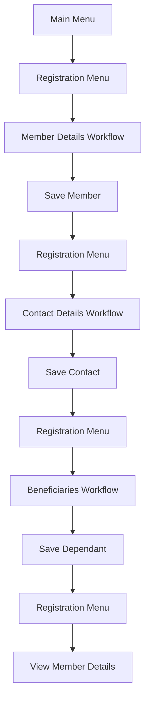
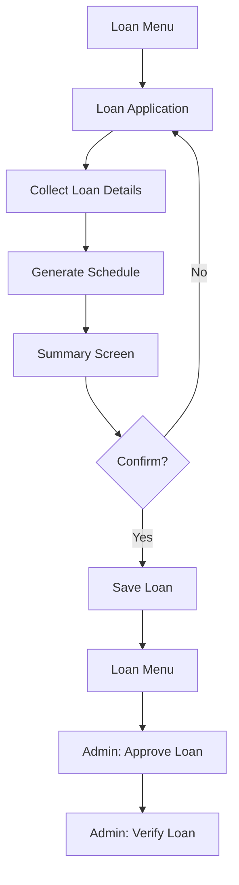

# Workflow Design Documentation

This document covers workflow configuration patterns specific to SACCO operations, menu system design, and integration with the database models.

## Overview

The sacco-schema system uses a menu-driven architecture where workflows are triggered from menu selections. Each workflow collects data through a series of screens, validates input, and persists data to the database upon completion.

## Menu System Architecture

### Menu Structure

Menus are defined as YAML files in `menus/menus/` and loaded at application startup. Each menu consists of:

- **Title**: Display title for the menu
- **Fields**: Numbered menu items with:
  - `id`: Unique identifier
  - `label`: Display text (supports i18n)
  - `workflow`: Workflow to execute (optional)
  - `function`: Function to call (optional)
  - `allowedRoles`: Role-based access control (optional)
  - `targetKeys`: Keys to extract from workflow data (optional)

### Menu Types

#### 1. Main Menu (`mainMenu.yml`)

The entry point for authenticated users:

```yaml
title: Welcome to Kaso SACCO
fields:
  "1":
    id: registration
    label:
      en: Membership Application
  "2":
    id: loan
    label:
      en: Loans
  "3":
    id: balance
    label:
      en: Check Balance
    function: checkBalance
```

**Navigation Flow**:
- User selects number (1-9)
- System routes to submenu or function
- Special commands: `00` = main menu, `99` = cancel

#### 2. Registration Menu (`registrationMenu.yml`)

Multi-step registration process:

```yaml
title: Choose Activity
fields:
  "1":
    id: registration.1
    label:
      en: Member Details
    workflow: member
    targetKeys:
      - dateOfBirth
      - firstName
      - lastName
      - phoneNumber
  "2":
    id: registration.2
    label:
      en: Contact Details
    workflow: memberContact
    targetKeys:
      - memberId
      - postalAddress
      - residentialAddress
```

**Features**:
- Sequential workflows for complete registration
- `targetKeys` specify which fields to extract
- Parent-child relationships via `memberId`

#### 3. Loan Menu (`loanMenu.yml`)

Loan management workflows:

```yaml
title: Loans
fields:
  "1":
    id: loan.1
    label:
      en: Loan Application
    workflow: memberLoan
    targetKeys:
      - loanAmount
      - repaymentPeriodInMonths
      - loanPurpose
  "7":
    id: loan.7
    label:
      en: Loan Repayment
    workflow: memberLoanPayment
```

**Role-Based Access**:
- Some items require `admin` role
- Filtered automatically in menu display
- Enforced at workflow level

## Workflow Configuration Patterns

### 1. Member Registration Workflow

**File**: `menus/workflows/member.yml`

**Structure**:

```yaml
cacheQueries:
  firstName: member.firstName
  lastName: member.lastName
  phoneNumber: member.phoneNumber
  # ... other fields

initialScreen: enterFirstName

enterFirstName:
  inputIdentifier: firstName
  nextScreen: enterLastName
  order: 1
  text:
    en: First Name
  type: inputScreen

enterLastName:
  inputIdentifier: lastName
  nextScreen: enterOtherName
  order: 2
  text:
    en: Last Name
  type: inputScreen

formSummary:
  type: quitScreen
```

**Key Features**:

1. **Cache Queries**: Pre-populate fields from existing member data
   - Format: `fieldName: model.field`
   - Resolved from session ActiveData

2. **Order Field**: Controls summary display order
   - Lower numbers appear first
   - Used in quitScreen summary

3. **Hidden Fields**: System-generated fields
   ```yaml
   enterId:
     hidden: true
     inputIdentifier: id
     type: hiddenField
   ```

4. **Default Values**: Auto-populated fields
   ```yaml
   enterDateJoined:
     default: CURRENT_TIMESTAMP
     hidden: true
     inputIdentifier: dateJoined
   ```

### 2. Loan Application Workflow

**File**: `menus/workflows/memberLoan.yml`

**Structure**:

```yaml
cacheQueries:
  loanAmount1: member.memberLoan.0.loanAmount
  loanNumber1: member.memberLoan.0.loanNumber
  # ... nested fields

enterLoanPurpose1:
  inputIdentifier: loanPurpose1
  nextScreen: enterLoanAmount1
  order: 1
  text:
    en: Loan Purpose
  type: inputScreen

enterLoanAmount1:
  inputIdentifier: loanAmount1
  nextScreen: enterRepaymentPeriodInMonths1
  order: 2
  validationRule: ^\d+\.*\d*$
  text:
    en: Loan Amount
  type: inputScreen

enterLoanSchedule1:
  inputIdentifier: loanSchedule1
  nextScreen: formSummary
  optional: true
  scheduleFormula: REDUCING_SCHEDULE({{loanAmount}},{{repaymentPeriodInMonths}},[{{processingFeeRate}}],[{{monthlyInterestRate}},{{monthlyInsuranceRate}}])
  text:
    en: Loan Schedule
  type: inputScreen
```

**Key Features**:

1. **Nested Cache Queries**: Access child model data
   - Format: `model.childModel.0.field`
   - `0` represents first child record
   - Used for editing existing loans

2. **Validation Rules**: Regex patterns for input validation
   ```yaml
   validationRule: ^\d+\.*\d*$  # Numbers only
   ```

3. **Schedule Generation**: Automatic payment schedule
   - `REDUCING_SCHEDULE()` formula
   - Calculates principal, interest, fees
   - Displays as formatted table

4. **Optional Fields**: Can be skipped
   ```yaml
   optional: true
   ```

### 3. Contribution Workflows

**Deposit Workflow** (`memberContributionDeposit.yml`):

```yaml
enterContributionNumber:
  inputIdentifier: contributionNumber
  nextScreen: enterAmount
  ajaxOptions: memberContribution@contributionNumber
  text:
    en: Contribution Number
  type: inputScreen

enterAmount:
  inputIdentifier: amount
  nextScreen: enterTransactionDate
  text:
    en: Amount
  type: inputScreen
```

**Key Features**:

1. **Ajax Options**: Dynamic dropdown from session data
   - Format: `model@field`
   - Loads options from ActiveData
   - Matches pattern: `model.field.0.value`, `model.field.1.value`

2. **Parent-Child Relationships**: Links to parent model
   - Contribution deposit links to contribution
   - Member ID automatically set from session

### 4. Verification Workflows

**Business Verification** (`memberBusinessVerification.yml`):

```yaml
enterVerified:
  inputIdentifier: verified
  nextScreen: enterVerifiedBy
  options:
    - label:
        en: Yes
      position: 1
    - label:
        en: No
      position: 2
  text:
    en: Verified
  type: inputScreen

enterVerifiedBy:
  inputIdentifier: verifiedBy
  nextScreen: enterDateVerified
  dynamicDefault: @user.0.username
  text:
    en: Verified By
  type: inputScreen
```

**Key Features**:

1. **Dynamic Defaults**: Pre-fill from session data
   - Format: `@model.index.field`
   - Resolved from ActiveData
   - Used for current user, dates, etc.

2. **Option-Based Navigation**: Dropdown selections
   - Numbered options
   - Position determines value stored

## Session Management

### Session Structure

Sessions are managed per phone number and contain:

- **ActiveData**: Flattened map of user's database records
  - Format: `model.id.field` or `model.index.field`
  - Example: `member.0.firstName`, `memberLoan.1.loanAmount`

- **GlobalIds**: Map of ID fields for parent linking
  - Format: `fieldNameId: {value: id}`
  - Used to link child records to parents

- **AddedModels**: Tracks which models user has added
  - Used to show `(*)` indicator in menus
  - Format: `modelName: true`

- **WorkflowsMapping**: Active workflow instances
  - Key: model name
  - Value: WorkFlow instance

### Cache Resolution

The `ResolveCacheData()` function extracts nested data:

```go
// Example: Extract member loan data
groupRoot := "member.memberLoan.0."
cache := ResolveCacheData(session.ActiveData, groupRoot)
// Result: {loanAmount1: 50000, loanNumber1: "LN001", ...}
```

**Pattern Matching**:
- Matches keys starting with `groupRoot`
- Extracts index and field name
- Reorganizes into flat map for workflow

### Session Refresh

Sessions refresh data from database:

```go
session.RefreshSession()
// Queries database for user's records
// Updates ActiveData with latest values
// Updates GlobalIds with current IDs
```

**When Refreshed**:
- After workflow submission
- On menu navigation
- Explicitly via menu functions

## Menu Function Patterns

### Function Signature

All menu functions follow this signature:

```go
func FunctionName(
    loadMenu func(string, *Session, string, string, string) string,
    params map[string]any,
    session *parser.Session,
) string
```

**Parameters**:
- `loadMenu`: Function to navigate to another menu
- `params`: Map containing:
  - `phoneNumber`: User's phone number
  - `text`: User input
  - `session`: Current session
  - `preferredLanguage`: User's language
  - `preferencesFolder`: Settings folder path
- `session`: Current session object

### Example: Check Balance

```go
func CheckBalance(
    loadMenu func(string, *Session, string, string, string) string,
    params map[string]any,
    session *parser.Session,
) string {
    // Query balance from database
    // Format response
    // Return USSD-formatted string
}
```

### Template-Based Functions

Some functions use templates for formatting:

**Business Summary** (`businessSummary_fn.go`):

```go
templateData := LoadTemplateData(session, "businessSummary")
// Loads data from ActiveData
// Formats using template
// Returns formatted summary
```

**Templates** (`menus/menuFuncs/templates/`):
- `businessSummary.template.json`
- `employmentSummary.template.json`
- `loanApplication.template.json`
- `member.template.json`

## Workflow Integration Patterns

### 1. Parent-Child Relationships

**Parent Model** (e.g., `member`):
```yaml
# Workflow collects member data
# Saves to member table
# Returns member ID
```

**Child Model** (e.g., `memberContact`):
```yaml
cacheQueries:
  memberId: member.id  # Links to parent

enterMemberId:
  hidden: true
  inputIdentifier: memberId
  type: hiddenField
```

**Linking Process**:
1. Parent workflow saves, returns ID
2. ID stored in `session.GlobalIds["memberId"]`
3. Child workflow reads from `GlobalIds`
4. Automatically linked on save

### 2. Array Children

**Multiple Records** (e.g., `memberDependant`):

```yaml
# Workflow can be run multiple times
# Each run creates new record
# All linked to same parent
```

**Menu Display**:
- Shows `(*)` if records exist
- Can add multiple dependants
- Each creates separate record

### 3. Workflow Chaining

**Sequential Workflows**:

```yaml
# Registration menu chains workflows:
# 1. member → returns memberId
# 2. memberContact → uses memberId
# 3. memberDependant → uses memberId (multiple)
```

**Navigation**:
- User completes workflow
- Returns to registration menu
- Can proceed to next workflow
- All data linked via IDs

## Cache Query Patterns

### Flat Cache Queries

**Single Model**:
```yaml
cacheQueries:
  firstName: member.firstName
  lastName: member.lastName
```

**Resolution**:
- Looks for `member.0.firstName` in ActiveData
- If found, pre-fills field
- If not found, field empty

### Nested Cache Queries

**Child Model**:
```yaml
cacheQueries:
  loanAmount1: member.memberLoan.0.loanAmount
  loanNumber1: member.memberLoan.0.loanNumber
```

**Resolution**:
- Looks for `member.memberLoan.0.loanAmount` in ActiveData
- Extracts from nested structure
- Pre-fills workflow fields

### Array Cache Queries

**Multiple Children**:
```yaml
cacheQueries:
  name1: member.memberDependant.0.name
  name2: member.memberDependant.1.name
```

**Resolution**:
- Extracts from array indices
- Maps to numbered fields
- Supports editing multiple records

## Data Persistence Patterns

### Save Process

1. **Workflow Submission**: User enters `0` on summary screen
2. **Data Collection**: All collected data in `WorkFlow.Data`
3. **Data Unpacking**: `fileHandling.SaveModelData()` unpacks nested data
4. **Parent Linking**: Links to parents via `GlobalIds`
5. **Database Save**: Calls `database.GenericsSaveData()`
6. **Session Refresh**: Updates ActiveData with new records

### RefData Handling

**Soft Deletes**:
```go
// If refData provided, compares with new data
// Missing IDs marked as inactive (active=0)
// Preserves referential integrity
```

**Use Case**: Updating member dependants
- Old: [1, 2, 3]
- New: [2, 3, 4]
- Result: 1 marked inactive, 4 added

### Float Field Conversion

**Automatic Conversion**:
```go
// String numbers converted to float64
// For fields in database.FloatFields
// Ensures correct data types
```

## Error Handling Patterns

### Validation Errors

**Input Validation**:
- Regex validation rules
- Required field checks
- Type validation

**Response**:
- Returns current screen with error
- User can correct and retry

### Database Errors

**Unique Constraint Violations**:
- Detected by error message
- Attempts update instead of insert
- Uses provided ID

**Lock Failures**:
- Retries up to 5 times
- Exponential backoff
- Returns error if all retries fail

### Workflow Errors

**Missing Data**:
- Formulas skip if data missing
- Optional fields can be empty
- Hidden fields auto-populated

## Best Practices

### 1. Field Ordering

Always set `order` field:
```yaml
order: 1  # Appears first in summary
order: 2  # Appears second
```

### 2. Cache Queries

Use cache queries for editing:
```yaml
cacheQueries:
  fieldName: model.field
```

### 3. Parent Linking

Always include parent ID in child workflows:
```yaml
enterParentId:
  hidden: true
  inputIdentifier: parentId
  type: hiddenField
```

### 4. Validation Rules

Add validation for numeric fields:
```yaml
validationRule: ^\d+\.*\d*$
```

### 5. Optional Fields

Mark optional fields explicitly:
```yaml
optional: true
```

### 6. Default Values

Use defaults for system fields:
```yaml
default: CURRENT_TIMESTAMP
hidden: true
```

## Advanced Patterns

### Conditional Navigation

**Based on User Role**:
```yaml
# Menu filters by allowedRoles
# Workflow can check session.SessionUserRole
# Skip screens based on role
```

### Dynamic Workflows

**Ajax-Based Options**:
```yaml
ajaxOptions: model@field
ajaxFields:
  - relatedField1
  - relatedField2
```

**Loads Options Dynamically**:
- From session ActiveData
- Includes related fields
- Cached for performance

### Formula Calculations

**Loan Schedule**:
```yaml
scheduleFormula: REDUCING_SCHEDULE(amount, duration, [oneTimeRates], [recurringRates])
```

**Other Formulas**:
- `SUM(term1, term2, ...)`: Sum values
- `DIFF(term1, term2, ...)`: Subtract values
- `DATE_DIFF_YEARS(start, end)`: Calculate years

## Integration Examples

### Complete Member Registration



### Loan Application Flow



## Troubleshooting

### Workflow Not Loading

- Check workflow file exists in `menus/workflows/`
- Verify YAML syntax
- Check menu references workflow correctly

### Cache Not Populating

- Verify cache query format: `model.field`
- Check session has ActiveData
- Ensure model name matches

### Parent Not Linking

- Verify parent ID in `GlobalIds`
- Check child workflow includes parent ID field
- Ensure parent saved before child

### Data Not Saving

- Check saveFunc provided
- Verify model exists in database
- Check for validation errors
- Review database logs

